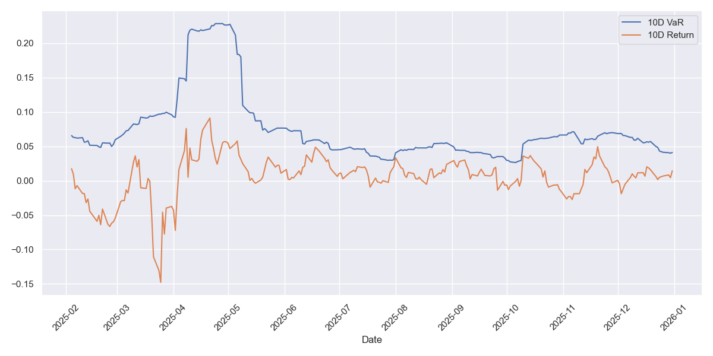
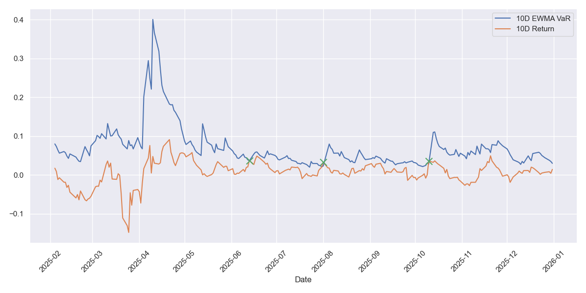

# Exam 1
Delegate: James Green

## Task 1
### a)
The constrained minimum-variance problem is transformed into an unconstrained optimisation by introducing Lagrange multipliers 
$\lambda$ and $\gamma$. The Lagrangian is;
$$
\begin{align*}
    L(x,\lambda) 
    &= f(x) + \sum_{j=1}^2 \lambda_j (g_j(x) - b_j)\\
    &= \frac{1}{2} \omega' \Sigma \omega + \lambda (m - \omega' \mu) + \gamma (1 - \omega' \mathbf{1}) 
\end{align*}
$$
Using the same $\lambda$ and $\gamma$ notation as in the notes.

For the first order conditions we partially differentiate with respect to $\omega$, $\lambda$ and $\gamma$.

$$
\begin{align*}
    \frac{\partial L}{\partial \omega} &=  \Sigma \omega - \lambda \mu - \gamma \mathbf{1} = 0\\
    \frac{\partial L}{\partial \lambda} &=  m - \omega' \mu = 0\\
    \frac{\partial L}{\partial \gamma} &=  1 - \omega' \mathbf{1} = 0\\
\end{align*}
$$


### b)
First we compute $\Sigma = SRS$

Where;

$$
\begin{align*}
    S =
        \left(\begin{matrix}
        0.05 & 0 & 0 & 0\\
        0 & 0.12 & 0 & 0\\
        0 & 0 & 0.17 & 0\\
        0 & 0 & 0 & 0.25\\
        \end{matrix}\right)
\end{align*}
$$

Then;
$$
\begin{align*}
    \Sigma =
        \left(\begin{matrix}
        0.0025 & 0.0018 & 0.00255 & 0.00375\\
        0.0018 & 0.0144 & 0.01224 & 0.018\\
        0.00255 & 0.01224 & 0.0289 & 0.0255\\
        0.00375 & 0.018 & 0.0255 & 0.0625\\
        \end{matrix}\right)
\end{align*}
$$

$$
\begin{align*}
    A &= \mathbf{1}' \Sigma^{-1} \mathbf{1} = 423.615\\ 
    B &= \mu' \Sigma^{-1} \mathbf{1} = 6.80702\\
    C &= \mu' \Sigma^{-1} \mu = 0.906509\\
    D &= AC - B^2 = 337.6735
\end{align*}
$$

### c)
For the budget constraint; we see $\sum_i \omega_i = 1$. Secondly for the expected return; 
$$
    \sum_i \omega_i \mu_i = 78.51\% \cdot 0.02 + 5.39\% \cdot 0.07 + 13.36\% \cdot 0.15 + 2.75\% \cdot 0.2 = 0.045015
$$

Both of these match to the required precision.

Finally, for the portfolio volatility, we have;

$$
\begin{align*}
    \sigma_\Pi^2 &= \frac{Am^2 - 2Bm + C}{AC - B^2} = \frac{423.615\cdot 4.5\%^2 - 2\cdot 6.80702\cdot 4.5\% + 0.906509}{337.6735} = 0.00341\\
    \sigma_\Pi &= 0.05840
\end{align*}
$$
Thus, we have verified the AI's results to suitable precision.


### d)
Rationale for why Asset A receives the largest allocation is:
 - It has the lowest correlation with the other asset classes, so contributes the least additional volatility to the portfolio.
 - It has the lowest volatility level out of all the assets, resulting in lower portfolio volatility for the given return.
 - The level of target return is 'only' 4.5%, all other assets are above this value, some significantly, meaning that we only need a small allocation of these to get the required return.


## Task 2
### a)
Before we verify anything, we need to pre-calculate some values, specifically;
$$
\begin{align*}
    \Sigma &= 
        \left(\begin{matrix}
        0.09 & 0.048 & 0.0225\\
        0.048 & 0.04 & 0.009\\
        0.0225 & 0.009 & 0.0225\\
        \end{matrix}\right)\\
    \omega^{\top}\Sigma\omega &= 0.043555\\
    \Sigma\omega &= 
        \left(\begin{matrix}
        0.06135 & 0.0347 & 0.0198\\
        \end{matrix}\right)
\end{align*}
$$
Now we can verify the AI's results;
$$
\begin{align*}
    \frac{\partial VaR}{\partial \omega_1} &= 0 + (-2.326) \cdot \frac{0.06135}{\sqrt{0.043555}} = -0.6838\\
    \frac{\partial VaR}{\partial \omega_2} &= 0 + (-2.326) \cdot \frac{0.0347}{\sqrt{0.043555}} = -0.3867\\
    \frac{\partial VaR}{\partial \omega_3} &= 0 + (-2.326) \cdot \frac{0.0198}{\sqrt{0.043555}} = -0.2207\\
\end{align*}
$$

Thus, showing these sensitivities match the AI's calculations.


### b)
The VaR is negative due to the long position of the portfolio, the sensitivity is negative as it represents the additional risk within the portfolio with an additional allocation to the specific asset.


### c)
This asset has the largest negative VaR for exactly these two reasons, the increase volatility by comparison to the other assets gives a higher marginal risk to higher VaR. Additionally, the elevated allocation means there is less diversification benefit so a higher VaR. It's also highly correlated with the other assets.

### d)
VaR is a quantile whereas ES is the expectation of all values beyond this significance level. Therefore, $|{ES}| > |{VaR}|$ as this distribution must have a mean that is strictly greater, in absolute values, than the maximum value of the distribution.

We can also explain this mathematically, the contributing factor we can see above is a comparison between $z_{\alpha}$ and $\frac{\phi(z_{\alpha})}{1-c}$. For large enough $c$ the second factor dominates.


## Task 3
First we must ingest and manipulate our data, specifically making it a time series to make the later calculations easier.
Also we can filter our columns down to just the S&P500 index, and to the specified date range.

```python
import pandas as pd
import numpy as np
import matplotlib.pyplot as plt
from scipy.stats import binom
import seaborn as sns

WINDOW = 21
FACTOR = 2.326

# ----------------------- Data Ingestion ---------------------------------
df = pd.read_excel('./Indices_Download_2026.xlsx',
                   parse_dates=['Date']).set_index('Date')
df = df.loc['2025-01-01':'2026-01-15']
df = df[['^GSPC']]
```

### a)
We now calculate our daily (log) return, and the rolling standard deviation from this. 
We already have calculated our $z_{\alpha}$ (from question 2), so our 10 day VaR is easy to calculate.
Finally, our 10 day forward is calculated by shifting our dataset.
We then need to drop any `NaN` values to ensure we calculate only over a valid domain.
Our `breaches` can then be calculated where the threshold is breached.
```python
df['return'] = np.log(df['^GSPC'] / df['^GSPC'].shift(1))
df['rolling_std'] = df['return'].rolling(WINDOW).std()
df['10_day_VaR'] = FACTOR * df['rolling_std'] * 10**0.5
df['10_day_forward_return'] = np.log(df['^GSPC'].shift(-10) / df['^GSPC'])
df = df.dropna(subset=['rolling_std', '10_day_forward_return', '10_day_VaR'])
df['breach'] = df['10_day_forward_return'] > df['10_day_VaR']
breaches = int(df['breach'].sum())

print(f'Number of VaR breaches: {breaches=}')
print(f'Percentage of breaches: {(breaches / len(df.index))=:.4f}')
```

```bash
Number of VaR breaches: breaches=0
Percentage of breaches: (breaches / len(df.index))=0.0000
```

### b)
Below is the full plot which shows the time series, the 10 day VaR and forwards.

We note that although there are no breaches, there is one specific date where it was incredibly close.

### c)
Assuming the breaches follow a $B\sim Binomial(229, 0.01)$ distribution we can use the `scypi` package to find our thresholds trivially.

```python
yellow_limit = binom.ppf(0.95, len(df.index), 0.01)
red_limit = binom.ppf(0.9999, len(df.index), 0.01)

print(f'Our lower bound for the yellow zone is {yellow_limit}')
print(f'Our lower bound for the red zone is {red_limit}')
```

```bash
Our lower bound for the yellow zone is 5
Our lower bound for the red zone is 10
```

Thus, we conclude, since we had zero breaches, that we are well within the green zone.
- Green Zone: 0 - 5
- Yellow Zone: 5 - 9
- Red Zone: 9+

## 4
### a)
We calculate our initial variance, then iterate over the rows to calculate the EWMA 1 day variance. 
We then compare this to the builtin pandas function, and see we are very close (off-by-one error due to initial variance).
Then we calculate the 10 day scaling as before.

```python
INITIAL_VAR = df['return'].var()
LAMBDA = 0.72

df['ewma_1d_var'] = np.nan
df.loc[df.index[0], 'ewma_1d_var'] = LAMBDA * \
    INITIAL_VAR + (1-LAMBDA) * df['return'].iloc[0]**2
for i in range(1, len(df.index)):
    df.iloc[i, df.columns.get_loc('ewma_1d_var')] = LAMBDA * df['ewma_1d_var'].iloc[i-1] + \
        (1 - LAMBDA) * df['return'].iloc[i-1] ** 2
df['ewma_1d_var_check'] = (df['return']**2).ewm(alpha=1-LAMBDA).mean()
df['ewma_10_day_VaR'] = FACTOR * np.sqrt(df['ewma_1d_var']) * 10**0.5
df['ewma_breach'] = df['10_day_forward_return'] > df['ewma_10_day_VaR']
ewma_breaches = int(df['ewma_breach'].sum())

print(f'Number of EWMA VaR breaches: {ewma_breaches=}')
print(f'Percentage of EWMA breaches: {(ewma_breaches / len(df.index))=:.4f}')
```

```bash
Number of EWMA VaR breaches: ewma_breaches=3
Percentage of EWMA breaches: (ewma_breaches / len(df.index))=0.0131
```

We can see under this methodology we have significantly more breaches but within the green zone, and more realistic in terms of percentage breaches.

### b)
Below is the full plot which shows the time series, the 10 day EWMA VaR and forwards, with markers showing where the breaches occur.

In this case we have breaches and can see the `x`'s denoting this.

### c)
In order the most responsive is EWMA, followed by rolling SD, then historical simulation. 
EWMA allows for a big weighting on the latest return value, specifically with a value of $\lambda=0.72$, we assign approximately 30% of the weight to the latest value.
Rolling SD has a 10 day window so only allocates c.10% to the latest value.
Finally historical simulation is the least adaptive since it uses a historical window to calculate VaR.
Therefore it is only using the volatility in the sampled timeframe, any new data won't be automatically included unless the sample window changes.
